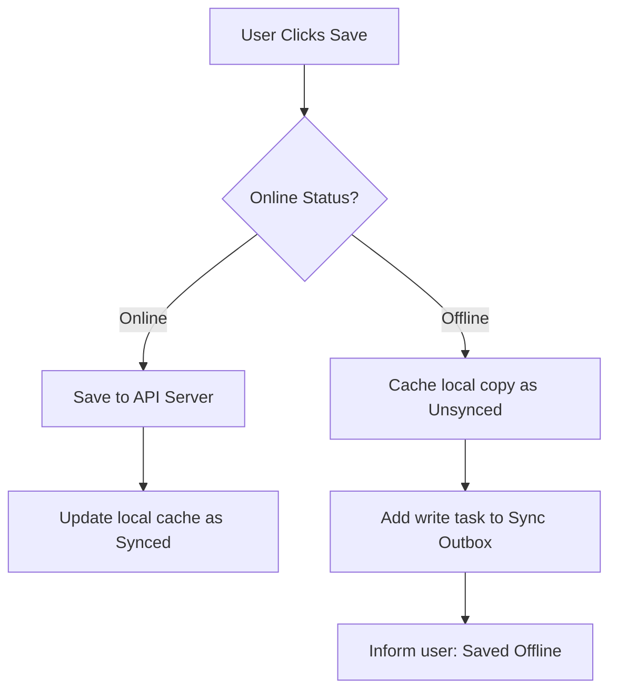
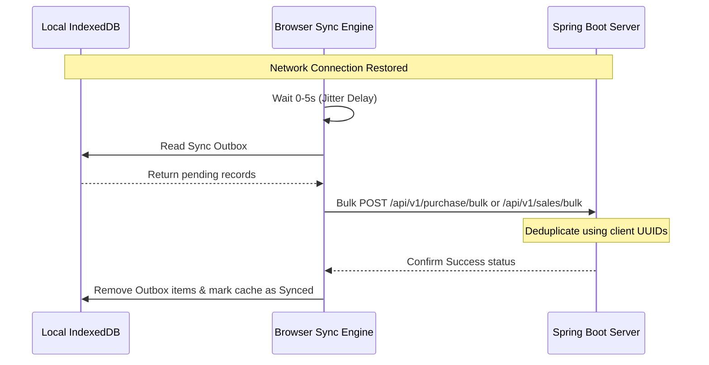

# Offline-First Synchronization Architecture

> [!NOTE]
> **System Architecture Presentation Summary:**
> *Instantly writes data to a local browser database (working offline or online), then background-syncs pending changes to the server once connection returns.*

---

## 1. Executive Summary: Core Concepts

| Component | Technology | File Locations | Why We Selected & Configured It This Way |
| :--- | :--- | :--- | :--- |
| **Local Cache** | IndexedDB & Dexie.js | [db.ts](file:///Users/shiva/Downloads/wmarket/BRT/src/lib/db.ts) | *Allows sub-millisecond local queries and handles GBs of data without blocking the UI thread.* |
| **Sync Outbox** | Axios & Dexie.js | [client.ts](file:///Users/shiva/Downloads/wmarket/BRT/src/api/client.ts) | *Transparently intercepts failures so the UI works exactly the same offline and online.* |
| **Jitter Delay** | JS Random & Hooks | [syncEngine.ts](file:///Users/shiva/Downloads/wmarket/BRT/src/api/syncEngine.ts) | *Prevents massive spikes of reconnecting clients from overloading the servers.* |
| **Bulk Batching** | REST API & JPA | [PurchaseController.java](file:///Users/shiva/Downloads/wmarket/BRT/backend-java/src/main/java/com/brt/purchase/PurchaseController.java) | *Groups many updates into a single payload to minimize network overhead and database sessions.* |
| **Idempotency** | UUIDv4 & Postgres | [PurchaseService.java](file:///Users/shiva/Downloads/wmarket/BRT/backend-java/src/main/java/com/brt/purchase/PurchaseService.java) | *Prevents database duplication if a network retry happens during connection drops.* |

---

## 2. Dynamic Workflow

---

## 3. Tech Architecture & Code Implementation Details

### A. Local Cache & Indexing (Client Storage)
* **What is used:** **IndexedDB** wrapped in **Dexie.js** for high-performance Promise-based operations.
* **Code Location:** 
  * Schema & Indexes: [db.ts](file:///Users/shiva/Downloads/wmarket/BRT/src/lib/db.ts)
  * Hook queries: [MenuPage.tsx](file:///Users/shiva/Downloads/wmarket/BRT/src/pages/MenuPage.tsx) (uses `useLiveQuery`).
* **Why:** 
  * Traditional `localStorage` has a strict 5MB limit, is completely synchronous, and blocks the browser UI thread during intensive reads/writes.
  * **IndexedDB** is fully asynchronous, supports transaction safety, scales to gigabytes, and indexes properties like `synced` for instant filtering.
  * **Dexie.js** provides standard Promise methods, type safety, and clean reactive hooks to trigger UI updates automatically when cached data changes.

### B. Sync Outbox & Network Interceptors
* **What is used:** **Axios Interceptors** (Request/Response) coupled with outbox tables in IndexedDB.
* **Code Location:** 
  * Interceptors: [client.ts](file:///Users/shiva/Downloads/wmarket/BRT/src/api/client.ts)
  * Outbox Schema: `syncOutbox` table in [db.ts](file:///Users/shiva/Downloads/wmarket/BRT/src/lib/db.ts)
* **Why:**
  * **Transparent Routing:** The frontend React components call standard `axios.post('/purchase')` requests. If offline, the request interceptor intercepts the failure, saves it to IndexedDB, and returns a successful response structure to the UI.
  * The frontend logic does not need complex conditional branches for offline states, drastically simplifying component design.
  * Storing payloads in the `syncOutbox` table guarantees that offline transactions persist even if the user closes their browser tab or restarts their device.

### C. Jitter Delay (Thundering Herd Protection)
* **What is used:** JavaScript randomized delay (`Math.random()`) and React network hooks monitoring `navigator.onLine`.
* **Code Location:**
  * Sync trigger & logic: [syncEngine.ts](file:///Users/shiva/Downloads/wmarket/BRT/src/api/syncEngine.ts)
  * Hook: [useNetwork.ts](file:///Users/shiva/Downloads/wmarket/BRT/src/hooks/useNetwork.ts)
* **Why:**
  * For applications serving millions of users, network reconnection spikes are a significant risk. If 1,000,000 users exit a subway station, their devices reconnect simultaneously.
  * Randomizing the execution of background sync by **0 to 5 seconds** (Jitter) flattens the connection curve, ensuring the backend server receives a steady stream of requests rather than a destructive traffic spike.

### D. Bulk Batching (Request Minimization)
* **What is used:** Spring Boot RestController endpoints accepting JSON Arrays, and JPA Bulk Save operations.
* **Code Location:**
  * Frontend batching: [syncEngine.ts](file:///Users/shiva/Downloads/wmarket/BRT/src/api/syncEngine.ts)
  * Backend Controller: [PurchaseController.java](file:///Users/shiva/Downloads/wmarket/BRT/backend-java/src/main/java/com/brt/purchase/PurchaseController.java) / [SalesController.java](file:///Users/shiva/Downloads/wmarket/BRT/backend-java/src/main/java/com/brt/sales/SalesController.java)
  * Backend Service: [PurchaseService.java](file:///Users/shiva/Downloads/wmarket/BRT/backend-java/src/main/java/com/brt/purchase/PurchaseService.java) / [SalesService.java](file:///Users/shiva/Downloads/wmarket/BRT/backend-java/src/main/java/com/brt/sales/SalesService.java)
* **Why:**
  * Making 100 individual HTTP POST requests creates severe latency overhead (TCP handshakes, HTTP headers, TLS negotiation, connection pool usage).
  * Grouping operations into arrays and posting them to `/bulk` endpoints cuts down overhead, allowing the database to execute changes within a single transactional session.

### E. Idempotency (Duplication Prevention)
* **What is used:** Client-side **UUIDv4** generation, Flyway migration files for Postgres schemas, and JPA `existsById` checks.
* **Code Location:**
  * UUID Generation: `crypto.randomUUID()` in [PurchasePage.tsx](file:///Users/shiva/Downloads/wmarket/BRT/src/pages/PurchasePage.tsx) and [SalesPage.tsx](file:///Users/shiva/Downloads/wmarket/BRT/src/pages/SalesPage.tsx)
  * Backend deduplication: `existsById(id)` in [PurchaseService.java](file:///Users/shiva/Downloads/wmarket/BRT/backend-java/src/main/java/com/brt/purchase/PurchaseService.java) and [SalesService.java](file:///Users/shiva/Downloads/wmarket/BRT/backend-java/src/main/java/com/brt/sales/SalesService.java)
* **Why:**
  * Standard numeric incrementing IDs (`BIGINT`) cannot be pre-assigned offline without collisions. Client-side generated UUIDs allow every device to create records offline concurrently without collision risk.
  * In unstable networks, a client might transmit a POST, the server saves it, but the network drops before the client receives the `HTTP 200 OK`. The client will retry during the next sync.
  * The backend checks if the UUID already exists in the database. If it does, the server skips saving it again, ensuring exactly-once processing.

---

## 4. Background Sync Sequence Diagram

